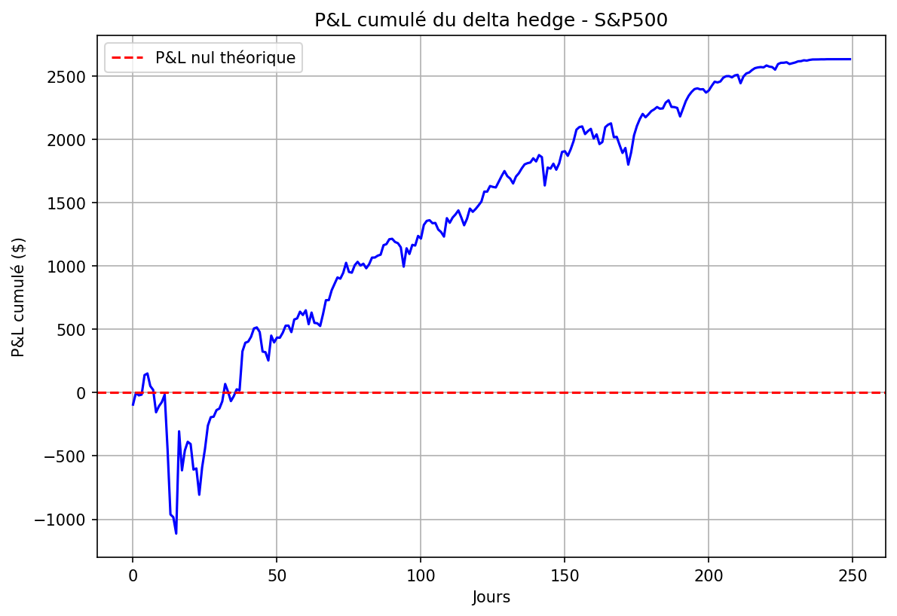

# Delta Hedging — S&P500

## Objectif
Simuler une stratégie de delta hedging sur le S&P500 et quantifier 
les imperfections du hedge en pratique.

## Graphiques

## Méthodologie
- Données historiques S&P500 sur 252 jours de trading (yfinance)
- Calcul du delta via Black-Scholes à chaque rebalancement
- Simulation du P&L résiduel jour par jour

## Résultats clés
- P&L résiduel : 2579$ sur 1 an — preuve que le hedge est imparfait
- Impact des coûts de transaction : 58$ soit 2.3% du P&L
- Rebalancement quotidien vs hebdomadaire : différence de seulement 21$

## Conclusions
1. Le delta hedge est imparfait car BS suppose un rebalancement continu
2. Sur un actif liquide les coûts de transaction restent limités
3. La fréquence optimale de rebalancement dépend du trade-off 
   précision vs coûts

## Limites
- Volatilité supposée constante (Black-Scholes)
- Pas de sauts dans les prix
- Coûts de transaction simplifiés
- Une seule option simulée

## Technologies
- Python, NumPy, Pandas, Matplotlib, yfinance
